# 🚀 Data Engineering Mastery Hub 🚀

---

### 🌟 *Where Data Meets Engineering Excellence* 🌟

---

## 📊 Repository Dashboard

<table>
<tr>
<td align="center">

</td>
<td align="center">

</td>
</tr>
<tr>
<td colspan="2" align="center">

</td>
</tr>
</table>

### 🎯 Project Metrics Dashboard

<table align="center">
<tr>
<th>📈 Metric</th>
<th>📊 Current</th>
<th>🎯 Target</th>
<th>📅 Status</th>
</tr>
<tr>
<td>⭐ Stars</td>
<td></td>
<td>1000+</td>
<td>🚀 Growing</td>
</tr>
<tr>
<td>🍴 Forks</td>
<td></td>
<td>500+</td>
<td>📈 Increasing</td>
</tr>
<tr>
<td>👀 Views</td>
<td></td>
<td>10K+</td>
<td>🔥 Viral</td>
</tr>
<tr>
<td>🐛 Issues</td>
<td></td>
<td><5</td>
<td>✅ Maintained</td>
</tr>
<tr>
<td>🔄 PRs</td>
<td></td>
<td>Active</td>
<td>💪 Healthy</td>
</tr>
<tr>
<td>📁 Files</td>
<td>250+</td>
<td>500+</td>
<td>📚 Expanding</td>
</tr>
</table>

---

## 🎨 Table of Contents

<table>
<tr>
<td width="50%">

### 🌟 Core Sections
- [🔬 **What is Data Engineering?**](#-what-is-data-engineering)
- [🧠 **Core Concepts**](#-core-concepts)
- [🌍 **Impact & Role**](#-impact--role)
- [🛠️ **Tools & Technologies**](#️-tools--technologies)

</td>
<td width="50%">

### 🚀 Growth Path
- [🗺️ **Complete Roadmap**](#️-complete-roadmap)
- [💎 **Top 1% Mastery**](#-top-1-mastery)
- [📚 **Learning Resources**](#-learning-resources)
- [🤝 **Community**](#-community)

</td>
</tr>
</table>

---

## 🔬 What is Data Engineering?

> **Data Engineering** is the backbone of modern data-driven organizations. It's the art and science of designing, building, and maintaining the infrastructure and architecture that enables data collection, storage, processing, and analysis at scale.

### 🎯 The Data Engineering Mission

<table>
<tr>
<td align="center" width="25%">

**🏗️ BUILD**
  
Robust data pipelines and infrastructure that can handle massive volumes of data with reliability and efficiency.

</td>
<td align="center" width="25%">

**🔄 TRANSFORM**
  
Raw, messy data into clean, structured, and accessible formats for analytics and machine learning.

</td>
<td align="center" width="25%">

**⚡ OPTIMIZE**
  
Data workflows for speed, cost-efficiency, and scalability to meet growing business demands.

</td>
<td align="center" width="25%">

**🛡️ SECURE**
  
Data throughout its lifecycle while ensuring compliance with privacy regulations and governance.

</td>
</tr>
</table>

---

## 🧠 Core Concepts

### 🎪 The Data Engineering Ecosystem

```mermaid
graph TB
    A[📡 Data Sources] --> B[🔄 Data Ingestion]
    B --> C[🏗️ Data Storage]
    C --> D[⚙️ Data Processing]
    D --> E[🎯 Data Serving]
    E --> F[📊 Analytics & ML]
    
    G[🔐 Data Governance] -.-> A
    G -.-> B
    G -.-> C
    G -.-> D
    G -.-> E
    
    H[📈 Monitoring] -.-> B
    H -.-> C  
    H -.-> D
    H -.-> E
    
    style A fill:#ff6b6b
    style B fill:#4ecdc4
    style C fill:#45b7d1
    style D fill:#96ceb4
    style E fill:#feca57
    style F fill:#ff9ff3
    style G fill:#54a0ff
    style H fill:#5f27cd
```

### 🎨 Essential Concepts Breakdown

<b>🚰 Data Pipelines - The Lifelines of Data</b>

 

**Data pipelines** are automated workflows that move data from source systems to destinations, applying transformations along the way.

**Key Characteristics:**
- **Reliability**: Handle failures gracefully
- **Scalability**: Process growing data volumes
- **Monitoring**: Provide visibility into data flow
- **Flexibility**: Adapt to changing requirements

**Pipeline Types:**
- 🔄 **Batch Processing**: Large volumes processed periodically
- ⚡ **Stream Processing**: Real-time data processing
- 🌊 **Lambda Architecture**: Combines batch and stream
- 🔀 **Kappa Architecture**: Stream-only approach

<b>📊 ETL vs ELT - The Great Transformation Debate</b>

 

<table>
<tr>
<th>🎯 Aspect</th>
<th>📥 ETL (Extract-Transform-Load)</th>
<th>📤 ELT (Extract-Load-Transform)</th>
</tr>
<tr>
<td><b>Processing Location</b></td>
<td>External processing engine</td>
<td>Target data warehouse</td>
</tr>
<tr>
<td><b>Data Volume</b></td>
<td>Better for smaller volumes</td>
<td>Handles big data efficiently</td>
</tr>
<tr>
<td><b>Flexibility</b></td>
<td>Fixed transformation logic</td>
<td>Ad-hoc transformations</td>
</tr>
<tr>
<td><b>Cost</b></td>
<td>Higher processing costs</td>
<td>Storage costs vs compute</td>
</tr>
</table>

<b>🏗️ Data Architecture Patterns</b>

 

**🎪 Modern Data Architecture Styles:**

1. **📊 Data Warehouse**: Centralized, structured data storage
2. **🏞️ Data Lake**: Raw data storage with schema-on-read
3. **🌊 Data Lakehouse**: Combines warehouse and lake benefits
4. **🎯 Data Mesh**: Decentralized, domain-oriented approach
5. **☁️ Cloud-Native**: Serverless and managed services

---

## 🌍 Impact & Role

### 🎯 Why Data Engineering Matters

**🚀 Business Impact:**
- Enable data-driven decision making
- Reduce time-to-insight from months to minutes
- Support AI/ML initiatives with quality data
- Ensure regulatory compliance and governance

### 👥 Who Benefits from Data Engineering?

<table>
<tr>
<td align="center" width="20%">

**📊 Data Scientists**
  
Get clean, reliable data for modeling and analysis

</td>
<td align="center" width="20%">

**📈 Business Analysts**
  
Access real-time dashboards and reports

</td>
<td align="center" width="20%">

**🤖 ML Engineers**
  
Automated data pipelines for model training

</td>
<td align="center" width="20%">

**💼 Executives**
  
Data-driven insights for strategic decisions

</td>
<td align="center" width="20%">

**👥 Customers**
  
Better products through data insights

</td>
</tr>
</table>

### 🌟 Real-World Impact Stories

**🎬 Netflix**: Personalized recommendations powered by massive data pipelines serving 200M+ users globally

**🚗 Uber**: Real-time data processing for dynamic pricing, route optimization, and fraud detection

**🛒 Amazon**: Supply chain optimization through predictive analytics and inventory management

**🏥 Healthcare**: Patient outcome improvements through real-time monitoring and predictive analytics

---

## 🛠️ Tools & Technologies

### 🎨 The Data Engineering Toolkit

<table>
<tr>
<th width="25%">🔧 Category</th>
<th width="25%">🌟 Popular Tools</th>
<th width="25%">☁️ Cloud Services</th>
<th width="25%">🔥 Trending</th>
</tr>
<tr>
<td align="center">

**📡 Data Ingestion**
  

</td>
<td align="center">

**⚙️ Processing**
  

</td>
<td align="center">

**☁️ Cloud Platforms**
  

</td>
<td align="center">

**🔥 Modern Stack**
  

</td>
</tr>
<tr>
<td align="center">

**🗄️ Storage**
  

</td>
<td align="center">

**🐳 Orchestration**
  

</td>
<td align="center">

**📊 Analytics**
  

</td>
<td align="center">

**🔍 Monitoring**
  

</td>
</tr>
</table>

### 🎪 Technology Stack Recommendations

<b>🥉 Beginner Stack - Your First Data Pipeline</b>

 

**🎯 Perfect for learning and small projects:**

- **Language**: Python + pandas
- **Database**: PostgreSQL
- **Orchestration**: Apache Airflow (local)
- **Visualization**: Apache Superset
- **Version Control**: Git + GitHub

**📚 Learning Path:**
1. Master SQL fundamentals
2. Learn Python for data manipulation
3. Build your first ETL pipeline
4. Deploy on local environment

<b>🥈 Intermediate Stack - Production Ready</b>

 

**🚀 Scalable solutions for growing teams:**

- **Processing**: Apache Spark + PySpark
- **Storage**: Cloud Data Warehouse (Snowflake/BigQuery)
- **Orchestration**: Apache Airflow (managed)
- **Streaming**: Apache Kafka
- **Monitoring**: Prometheus + Grafana
- **IaC**: Terraform

**🎯 Focus Areas:**
- Distributed computing concepts
- Cloud platform expertise
- Data quality and testing
- Performance optimization

<b>🥇 Expert Stack - Enterprise Scale</b>

 

**⚡ For massive scale and complex requirements:**

- **Modern Data Stack**: Fivetran + Snowflake + dbt + Looker
- **Real-time**: Apache Flink + Apache Pulsar
- **ML Ops**: Databricks + MLflow + Kubeflow
- **Data Governance**: Apache Atlas + Collibra
- **Kubernetes**: For container orchestration

**🌟 Advanced Topics:**
- Data mesh architecture
- Real-time ML inference
- Data lineage and governance
- Multi-cloud strategies

---

## 🗺️ Complete Roadmap

### 🎯 The Journey to Data Engineering Mastery

### 🚀 Detailed Learning Path

<table>
<tr>
<th width="20%">🎪 Phase</th>
<th width="30%">🎯 Core Skills</th>
<th width="25%">🛠️ Tools to Master</th>
<th width="25%">📚 Projects</th>
</tr>
<tr>
<td>

**🌱 Foundation**
 *(3 months)*

</td>
<td>

- SQL mastery
- Python programming
- Data structures
- Basic statistics
- Linux fundamentals

</td>
<td>

- PostgreSQL
- Python + pandas
- Jupyter notebooks
- Git/GitHub
- Docker basics

</td>
<td>

- Personal expense tracker
- Web scraping project
- Simple ETL pipeline
- Data visualization dashboard

</td>
</tr>
<tr>
<td>

**🚀 Core Development**
 *(5 months)*

</td>
<td>

- Data modeling
- Pipeline orchestration
- Cloud computing
- API development
- Testing strategies

</td>
<td>

- Apache Airflow
- AWS/GCP services
- Apache Spark
- REST APIs
- pytest/unittest

</td>
<td>

- E-commerce data pipeline
- Real-time dashboard
- Data quality framework
- Cloud-native ETL

</td>
</tr>
<tr>
<td>

**⚡ Advanced Engineering**
 *(4 months)*

</td>
<td>

- Stream processing
- Data warehousing
- Infrastructure as Code
- Performance optimization
- Security best practices

</td>
<td>

- Apache Kafka/Flink
- Snowflake/BigQuery
- Terraform/Pulumi
- Kubernetes
- dbt (data build tool)

</td>
<td>

- Real-time analytics platform
- Modern data warehouse
- Automated infrastructure
- ML feature store

</td>
</tr>
<tr>
<td>

**🏆 Expert Mastery**
 *(Ongoing)*

</td>
<td>

- System architecture
- Data governance
- ML operations
- Team leadership
- Business strategy

</td>
<td>

- Data mesh tools
- MLOps platforms
- Governance solutions
- Monitoring systems
- Architecture patterns

</td>
<td>

- Enterprise data platform
- Data governance framework
- ML production pipelines
- Open source contributions

</td>
</tr>
</table>

---

## 💎 Top 1% Mastery

### 🌟 What Sets Apart the Elite Data Engineers?

> **The top 1% don't just build data pipelines - they architect data ecosystems that scale, adapt, and deliver business value consistently.**

### 🎯 Elite Skills Matrix

<table>
<tr>
<th>🏆 Mastery Level</th>
<th>📊 Technical Depth</th>
<th>🧠 System Thinking</th>
<th>💼 Business Impact</th>
</tr>
<tr>
<td>

**🥇 Top 1%**

</td>
<td>

- Design distributed systems
- Optimize at petabyte scale  
- Create new architectures
- Contribute to open source

</td>
<td>

- Think in terms of ecosystems
- Predict system failures
- Design for 10x growth
- Balance trade-offs expertly

</td>
<td>

- Drive strategic decisions
- Quantify business value
- Enable new revenue streams
- Mentor next generation

</td>
</tr>
<tr>
<td>

**🥈 Top 10%**

</td>
<td>

- Master multiple clouds
- Handle complex pipelines
- Implement best practices
- Lead technical projects

</td>
<td>

- Design scalable solutions
- Understand dependencies
- Plan for reliability
- Consider security first

</td>
<td>

- Reduce costs significantly
- Improve data quality
- Enable faster insights  
- Support business growth

</td>
</tr>
<tr>
<td>

**🥉 Competent**

</td>
<td>

- Build reliable pipelines
- Use industry tools
- Follow documentation
- Solve defined problems

</td>
<td>

- Understand data flow
- Debug methodically
- Test systematically
- Document clearly

</td>
<td>

- Meet SLA requirements
- Support data consumers
- Maintain existing systems
- Follow compliance rules

</td>
</tr>
</table>

### 🚀 The Elite Data Engineer's Toolkit

<b>🧠 Systems Design Mastery</b>

 

**🎯 Core Competencies:**
- Design data systems for millions of users
- Balance CAP theorem trade-offs
- Architect for fault tolerance and recovery
- Optimize for cost and performance simultaneously

**📚 Study Areas:**
- Distributed systems fundamentals
- Database internals and storage engines
- Network protocols and data serialization
- Consensus algorithms and replication

**🛠️ Hands-on Practice:**
- Build your own data storage engine
- Implement distributed consensus
- Design multi-region data replication
- Create custom data processing frameworks

<b>📊 Data at Scale Expertise</b>

 

**⚡ Scaling Dimensions:**
- **Volume**: Petabytes of data daily
- **Velocity**: Sub-second processing requirements  
- **Variety**: Structured, semi-structured, unstructured
- **Veracity**: Data quality at massive scale

**🎪 Advanced Techniques:**
- Columnar storage optimization
- Adaptive query execution
- Dynamic partitioning strategies
- Real-time data compaction

**🔬 Research Areas:**
- Quantum computing for data processing
- Machine learning for query optimization
- Approximate algorithms for big data
- Edge computing for data processing

<b>🌟 Innovation & Leadership</b>

 

**🚀 Innovation Tracks:**
- Contribute to Apache projects
- Publish research papers
- Speak at major conferences
- Create industry standards

**👥 Leadership Skills:**
- Mentor junior engineers
- Define technical roadmaps
- Bridge business and technology
- Build high-performing teams

**🎯 Impact Metrics:**
- Cost savings achieved
- Performance improvements
- Team productivity gains
- Business outcomes enabled

---

## 📚 Learning Resources

### 🎪 Curated Learning Pathways

<table>
<tr>
<td width="25%" align="center">

**📖 Books**
  

</td>
<td width="25%" align="center">

**🎥 Courses**  
  

</td>
<td width="25%" align="center">

**🛠️ Projects**
  

</td>
<td width="25%" align="center">

**📰 Blogs**
  

</td>
</tr>
</table>

### 📖 Essential Reading List

<b>🆠Must-Read Books for Data Engineers</b>

 

**🎯 Fundamentals:**
1. **"Designing Data-Intensive Applications"** by Martin Kleppmann
2. **"Data Engineering with Python"** by Paul Crickard
3. **"Building Data Pipelines with Python"** by Brij Kishore Pandey

**⚡ Advanced Topics:**
4. **"Streaming Systems"** by Tyler Akidau
5. **"The Data Warehouse Toolkit"** by Ralph Kimball
6. **"Database Internals"** by Alex Petrov

**🏢 Architecture & Leadership:**
7. **"Building Evolutionary Architectures"** by Neal Ford
8. **"The Software Engineer's Guidebook"** by Gergely Orosz
9. **"Staff Engineer"** by Will Larson

### 🎥 Video Learning Resources

<table>
<tr>
<td width="50%">

**🎪 YouTube Channels**
- Seattle Data Guy
- Data Engineering Zoomcamp
- Confluent (Kafka tutorials)
- AWS Training & Certification
- Google Cloud Tech

</td>
<td width="50%">

**💻 Online Platforms**
- DataCamp Data Engineering track
- Coursera Data Engineering specializations
- Udacity Data Engineering Nanodegree
- A Cloud Guru (Cloud platforms)
- Linux Academy (Infrastructure)

</td>
</tr>
</table>

### 🛠️ Hands-On Practice Resources

**🎯 Coding Practice**
- LeetCode Database problems
- HackerRank SQL challenges
- Kaggle Learn micro-courses
- GitHub open source projects
- Personal portfolio projects

**☁️ Cloud Sandboxes**
- AWS Free Tier projects
- Google Cloud $300 credits
- Azure Free Account
- Databricks Community Edition
- Snowflake free trial

---

## 🤝 Community

### 🌟 Join the Data Engineering Community

[![Discord](https://img.shields.io/badge/Discord-Join%20Community-7289da?style=for-the-badge&logo=discor
